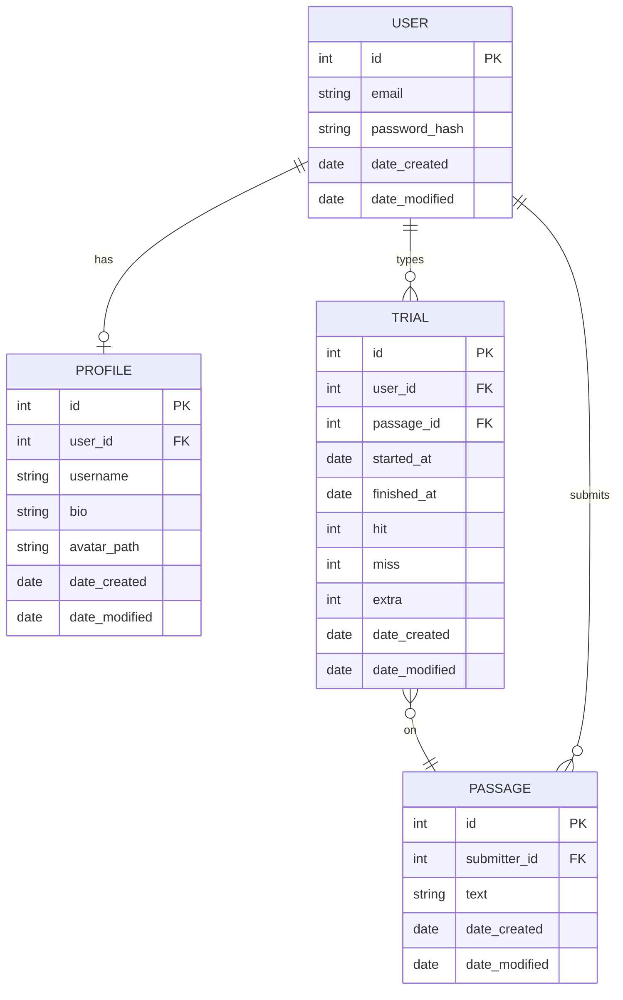

# My ERD

```mermaid
erDiagram
  USER ||--o| PROFILE : has
  TRIAL }o--|| PASSAGE : on
  USER ||--o{ TRIAL : types
  USER ||--o{ PASSAGE : submits

  USER {
    int id PK
    string email
    string password_hash

    date date_created
    date date_modified
  }

  PROFILE {
    int id PK
    int user_id FK
    string username
    string bio
    string avatar_path

    date date_created
    date date_modified
  }

  TRIAL {
    int id PK
    int user_id FK
    int passage_id FK
    date started_at
    date finished_at
    int hit
    int miss
    int extra

    date date_created
    date date_modified
  }

  PASSAGE {
    int id PK
    int submitter_id FK
    string text

    date date_created
    date date_modified
  }
```
