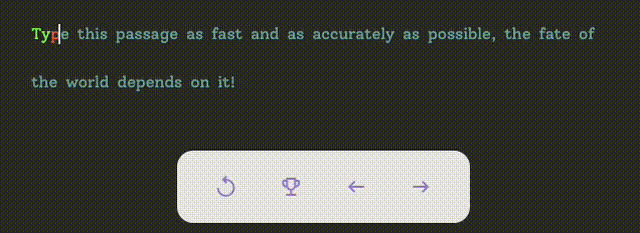

# Typey

## About

A monorepo typing app with user submitted passages. It allows users to practice their typing skills, track their progress, and improve their speed and accuracy over time.



## Live Demo

[Come check out the live demo!](http://typey.ewbi.co.uk)

## Requirements

You will need the following installed on your system:

1. [Docker](https://www.docker.com/products/docker-desktop/)
2. [pnpm](https://pnpm.io/installation)

## Installation

To install and run this project locally, follow these steps:

1. **Clone the repository**:

   ```sh
   git clone https://github.com/EwbiDev/typey.git
   cd typey
   ```

2. **Install dependencies**:

   ```sh
   pnpm install
   ```

3. **Run the application**:

   Ensure your docker service is running and then:

   ```sh
   pnpm start
   ```

## Usage

After running the application, open your browser and navigate to `http://localhost:5173`.

## Dependencies

- **Node.js**: A JavaScript runtime built on Chrome's V8 JavaScript engine.
- **TypeScript**: A typed superset of JavaScript that compiles to plain JavaScript.
- **Docker**: A platform for developing, shipping, and running applications.

## Contact Information

For any questions or issues, please open an issue on this repository or contact [EwbiDev](https://github.com/EwbiDev).
